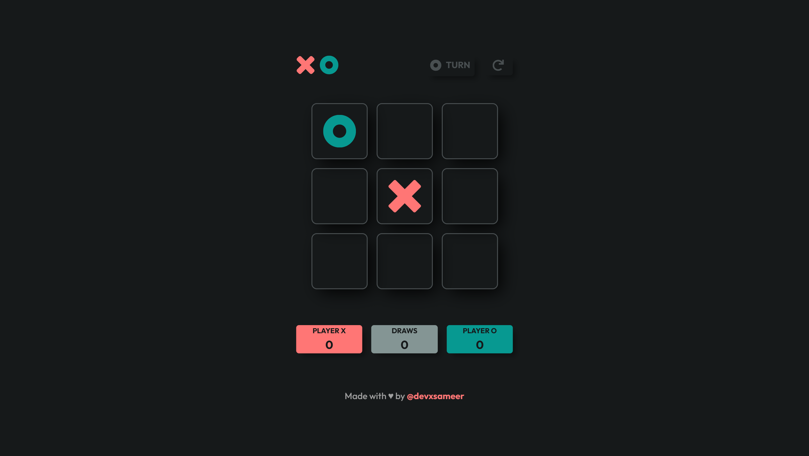

# 🎮 Tic Tac Toe – Modular JS Edition

A fully interactive and modular **Tic Tac Toe game** built using vanilla JavaScript, the **Module Pattern**, and a custom **publish–subscribe (PubSub)** event system.  
This project is part of [The Odin Project](https://www.theodinproject.com/) JavaScript curriculum — enhanced with clean architecture and a responsive UI.

---

## 🌐 Live Demo

🎮 [Play Now](https://devxsameer.github.io/tic-tac-toe/)  
📦 [GitHub Repo](https://github.com/devxsameer/tic-tac-toe)

---

## 🖼️ Screenshots

---

## ✅ Features

- 🧩 Structured using **IIFE & Module Pattern**
- ❌⭕ Play as 2 players, no page reload required
- 🔁 Play again/reset option with smooth UX
- 🧵 Custom **PubSub module** (event system) for clean decoupling
- 💡 No global variables — everything scoped
- 🎯 Win/draw detection and real-time UI feedback
- 📱 Responsive and accessible UI

---

## 📦 Modules

- `GameBoard` – holds board state, game logic, turns, outcome
- `DisplayController` – updates UI and messages
- `PubSub` – custom publish-subscribe event system

---

## 🧠 What I Practiced

- Writing modular JavaScript with **clear separation of concerns**
- Avoiding globals using **closures & scoped IIFEs**
- Implementing a **publish–subscribe architecture** to decouple logic and UI
- Responsive design and DOM manipulation
- UX principles for player feedback and interaction flow

---

## 🙌 Credits

Built as part of [The Odin Project’s JavaScript Curriculum](https://www.theodinproject.com/lessons/javascript-tic-tac-toe).

---

## 💬 Final Thoughts

> Modular JS + Tic Tac Toe = clean code, clean wins.  
> No globals were harmed in the making of this game. ❌⭕✅

#100DaysOfCode #JavaScript #TicTacToe #TheOdinProject #Frontend #IIFE #ModularJS #PubSub #WebDev
